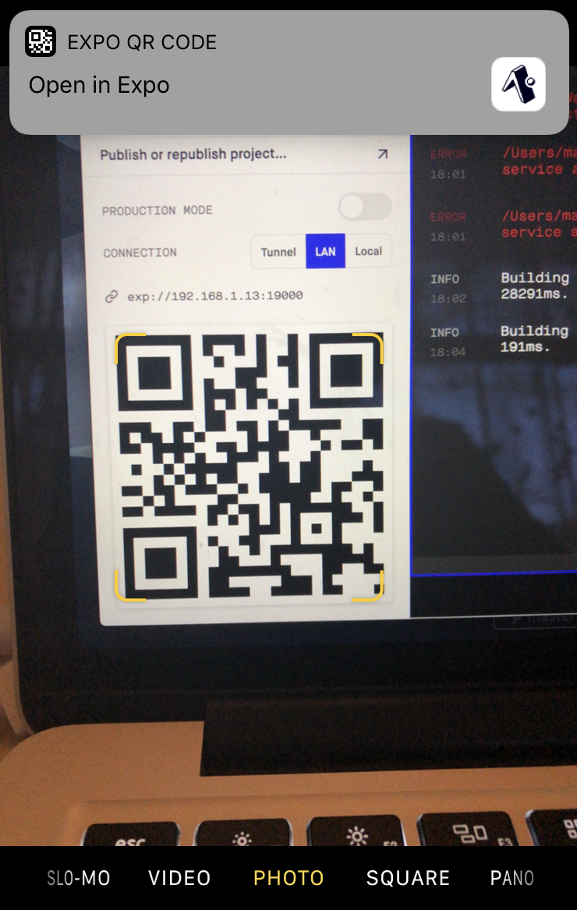
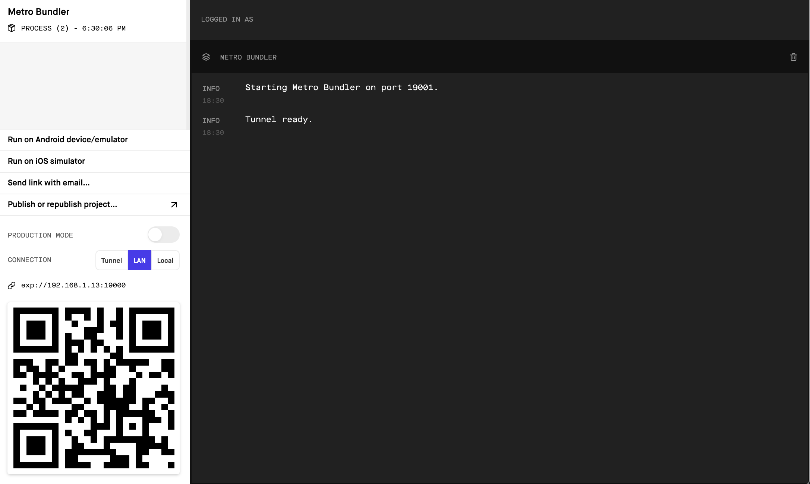

# hello-native

## quickstart

Assuming you've done `npm install` to install dependencies:

1. `npm start` to start app
2. optional: `npx tsc --watch` in a new tab if you want your typechecking in a terminal window (vs, say, inline in VSCode)
3. Open app
   * on phone via QR code and expo-client
   * in simulator with xcode

## requirements

* `node`
* `expo-cli`: you can install it globally if you want with `npm install --global expo-cli`, or if you run `npm install` in a project that requires it, it will also prompt you to install it.
* expo client: for running the app on your device
  * [iOS](https://itunes.apple.com/app/apple-store/id982107779)
  * [android](https://play.google.com/store/apps/details?id=host.exp.exponent&referrer=www)
* xcode, if you want to run it on the ios simulator. to open the debug tools in the simulator, use `cmd-D`; on a device, shake it real hard.

## working on a project

The first time you clone down the project, run `npm install` to install dependencies.

`npm start` starts the server/bundler. If you don't already have `expo-cli` installed -- it isn't installed via `npm install` unfortunately -- it will prompt you to install it.

once it's loaded, you scan the qr code with your phone; on an iPhone, you just need to open your camera and get the QR code in focus. A little dialogue should pop up that says 'Open in EXPO'.



If you'd rather use the xcode simulator, click the "Run on iOS simulator" link in the dev server page. If you get an error, run `sudo xcode-select -s /Applications/Xcode.app` in your terminal -- nothing will change visibly, then try pressing the button again.

I had to quit Simulator once after that and then try reopening it again; then it said it was downloading the expo client onto the simulator device and things were fine.

### fyi

The page that opens in your browser from the terminal is basically the console. You can show either the server logs or the server log + the log for the device (which looks so far like it's more akin to the browser console not surprisingly -- eg, React stack traces show up in here.)

It should have a thing about connection type -- set to `LAN` most likely.



### issues
* if you get an error about how the QR code contains no usable data, make sure you have the expo client installed on your phone and try starting/stopping the server.
* make sure you are on the same network on your device as you are on the computer you're using

## notes

* yes, there's live reloading apparently
* strings and text must be wrapped in a `Text` component. eg:
  ```jsx
  // this is OK
  const SomeOkaything = (
    <View>
      <Text>hello world</Text>
    </View>
  );

  // Invariant Violation: Text strings must be rendered within a <Text> component.
  const SomeBadThing = (
    <View>
      i'm wrong :(
    </View>
  );
  ```

